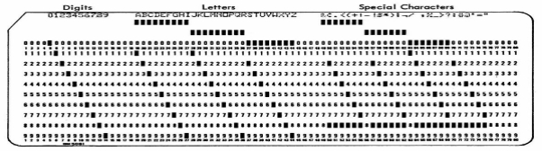

**МІНІСТЕРСТВО ОСВІТИ І НАУКИ УКРАЇНИ** 

**ДЕПАРТАМЕНТ ОСВІТИ І НАУКИ ВИКОНАВЧОГО ОРГАНУ** 

**КИЇВСЬКОЇ МІСЬКОЇ РАДИ** 

**(КИЇВСЬКОЇ МІСЬКОЇ ДЕРЖАВНОЇ АДМІНІСТРАЦІЇ)**

` `**КИЇВСЬКЕ ТЕРИТОРІАЛЬНЕ ВІДДІЛЕННЯ МАЛОЇ АКАДЕМІЇ НАУК УКРАЇНИ** 

**КОМУНАЛЬНИЙ ПОЗАШКІЛЬНИЙ НАВЧАЛЬНИЙ ЗАКЛАД** 

**«КИЇВСЬКА МАЛА АКАДЕМІЯ НАУК УЧНІВСЬКОЇ МОЛОДІ»** 

**Відділення «Інформатіки»**

` `**Секція: «Мультимедійні системи, навчальні та ігрові програми»**

**Історія розвитку**

**комп’ютерної архітектури**

`                                                       `**Роботу виконав: Почко Дмитро Юрійович**

`  `**Учень 8 класу Києво-Печерський Ліцей № 171 «Лідер»,** 

`                                            `**Печерського району міста Києва** 

`                                                        `**Педагогічний керівник:** 

`                                             `**Чалик Мар’яна Васильївна  – вчитель інформатики**

`                         `**Києво-Печерського ліцею № 171 «Лідер»**

`                                                        `**міста Києва**

**Київ - 2023**

ЗМІСТ

Вступ                                                                                                                        3

Архітектура комп’ютера                                                                                         5

Архітектура: як працює комп’ютер. Основні компоненти комп’ютера             5

Розвиток комп'ютерної архітектури                                                                       7

Історія обчислювальної техніки та архітектури комп'ютерів                              7

Нульове покоління – механічні комп'ютери (1642–1945)                                    9

Перше покоління – електронні лампи (1945–1955)                                             12

Друге покоління - транзистори (1955-1965)                                                         15

Шина комп'ютера PDP -8                                                                                        16

Третє покоління – інтегральні схеми (1965–1980)                                               18

Четверте покоління - надвеликі інтегральні схеми (1980-?)                               19

П'яте покоління: комп'ютери невеликої потужності, невидимі комп'ютери      22

Шосте покоління. Квантовий комп’ютер                                                         23

Висновки                                                                                                            23

Перелік літератури та використаних джерел                                                  27
\***

***Вступ***

*Всесвіт, якій оточує людину, складається з фізичних об’єктів. Ці об’єкти можна рахувати. Розвиток людської цивілізації, створення знарядь праці, удосконалення власних можливостей людини призводили до збільшення кількості здобичі, врожаю, територій. «Першого персонального комп’ютера» – пальців – ставало замало. Людина починала мислити більшими категоріями, отримувала більше фізичних об’єктів у своє розпорядження, що створило потребу рахувати.* 

*З’явились «Антікітерський механізм» (Греція) для розрахунку руху Сонця та Місяця, абак, суан-пан, китайські рахунки, рахункові вузлики, соробан. Минули віки й з’явились обчислювальна, різницева й аналітична машини.*

*Розвиток технологій та виробництва породжував нові потреби і можливості, відкриття та винаходи. Транзисторні змінили лампові комп’ютери, за ними прийшли інтегральні схеми, зараз увага прикута до квантових комп’ютерів. Квантові комп’ютери здатні моделювати квантові системи та молекули ДНК.*

*Архітектура комп’ютера складається з окремих частин.  На архітектуру комп'ютерів впливає їх призначення: для військових, наукових та економічних розрахунків, для керування та бізнесу, для учнів та персональних користувачів. А також  вартість, потужність, габарити,  прибуток.*

*Мініатюризація та нові винаходи дозволяли збільшувати обсяг пам'яті. При досягненні певної межі обсягу пам'яті змінювалися  архітектура, і методи програмування та пристрій, операційна система.*

*На успішність поширення архітектури та комп'ютерів  впливають  їх ефективність, швидкість,  обсяг пам’яті, габарити, конкуренція та ціна.*

*Технологічні та економічні аспекти. За темпами розвитку комп'ютерна промисловість випереджає всі інші галузі. Головна рушійна сила — здатність виробників поміщати з кожним роком дедалі більше транзисторів на мікросхему. Чим більше транзисторів (маленьких електронних перемикачів), тим більший обсяг пам'яті та потужніші процесори.* 

*Закон Мура пов'язаний із тим, що деякі економісти називають ефективним циклом. Досягнення в комп'ютерних технологіях (збільшення кількості транзисторів на одній мікросхемі) призводять до продукції кращої якості та нижчих цін. Низькі ціни ведуть до появи нових сфер застосування.*

*Удосконалення комп’ютерної архітектури – це такий же вічний процес, як і бажання людини досягти досконалості.  Досягти досконалості не завжди можливо, але прагнути цього сучасна високо-технологічна "комп'ютерна цивілізація" буде вічно.*
\*

**Архітектура комп’ютера**

Архітектура комп’ютера складається з окремих частин. Розробка передбачає визначення кількості компонентів та яку роль відіграє кожен із них і яким чином буде передаватись інформація.

Ця ідея схожа на будівельну архітектуру. Тип кімнати, розмір кімнати, розташування кімнати, як кімнати з’єднані тощо. Архітектура комп’ютера, як і будівлі, певною мірою залежить від використовуваної технології. Архітектура будівлі проектується по-різному залежно від того,  фундамент зроблено з цегли, дерева, бетону чи сталі.  Як і будівля, якість архітектури комп’ютера оцінюється з точки зору того, наскільки вона корисна для користувача.

Архітектура комп’ютера — це інтерфейс між програмним і апаратним забезпеченням. Простіше кажучи, це опис того, як апаратне забезпечення працює з точки зору програмного забезпечення.

**Архітектура: як працює комп’ютер**

**Основні компоненти комп’ютера** 

Базова конфігурація комп’ютера. Комп’ютер отримує деякі вхідні дані ззовні, виконує обчислення та обробку та виводить результати назовні. Введення та виведення обробляються пристроями введення/виведення.**  Центральний процесор контролює весь потік даних і обробку.

Щоб комп’ютер міг виконувати обробку, йому потрібна програма, яка описує кроки обробки. Програма містить серію інструкцій і даних, які використовуються і всі вони тимчасово зберігаються у пам’яті**.** Центральний процесор отримує кожну інструкцію з пам’яті, декодує її та виконує дію на основі цієї інструкції. 

Майже всі сучасні комп’ютери виконують команди, зберігаючи програми в пам’яті. І навпаки, різні програми можуть виконувати різні обчислення. Цей тип комп’ютера називається комп’ютером із збереженням програм**.** Галузь, яка вивчає основну структуру та роботу комп’ютерів, називається архітектурою комп’ютера**.** Вона займається питаннями, пов’язаними з апаратним забезпеченням**.** З іншого боку, програми які належать до програмного забезпечення. Можна сказати, що програмне забезпечення – це сукупність ноу-хау щодо правильного використання апаратного забезпечення.

Деталі процесора та пам**'**яті 

Механізм керування знаходиться в центрі центрального процесора.  Арифметичний механізм буквально виконує числові та логічні операції. Є також деякі спеціальні області пам'яті всередині процесора. У центральному процесорі є багато інших спеціальних запам’ятовуючих пристроїв (регістрів) з різними цілями.

Регістр має значення запису швидше, ніж пам'ять для нормального доступу.  Важливо, щоб певні області пам'яті були виділені адресами. Спеціальна пам'ять, пов'язана з адресами, включає лічильники інструкцій, адресні регістри та індексні регістри.** Лічильник інструкцій запам'ятовує в пам'яті адресу інструкції, яку потрібно виконати. Адресний регістр містить адресу даних (або іншу інструкцію), на яку посилається інструкція. 

Регістр інструкцій - це пам'ять, яка містить самі інструкції. Акумулятор - це пам'ять, яка зберігає значення операндів при виконанні операцій. Центральний процесор не виконує обчислення безпосередньо з пам’яттю, а натомість зберігає дані в накопичувачі. 

` `Шина даних використовується для обміну даними між центральним процесором і пам’яттю (дані також містять інструкції). Крім того, щоб мати можливість читати та записувати дані в пам’ять, необхідно підготуватися заздалегідь. Шина, по якій проходять сигнали керування для підготовки, є шиною керування .

**Розвиток комп'ютерної архітектури**

У ході розвитку комп'ютерних технологій було розроблено сотні різних комп'ютерів. Деякі з них цілком забуті, принципи праці інших суттєво вплинули на формування та розвиток сучасних технологій.

**Історія обчислювальної техніки та архітектури комп'ютерів**

**Періодизація поколінь комп'ютерів:**

- • переднульове покоління (87 р. до н.е. - 1623). 

  *«Антікітерський механізм» (Греція) для розрахунку руху Сонця та Місяця, абак, суан-пан, китайські рахунки, рахункові вузлики, соробан*

- • нульове покоління  "механічні" комп'ютери (1623-1939/40)

  *Німеччина, Вільгельм Шиккард 6-розрядна обчислювальна машина*

*Франція, Жозеф Марі Жоккар перфокарти*

*Англія, Чарльз Беббідж різницева, аналітична машини*

*Франція, Блез Паскаль, лічильна машина*

- • перше покоління - лампові комп'ютери (1940/41-1951)

  *Комп’ютери «майже першого» покоління – пристрої на електромагнітних реле та електронних лампах – попередники комп’ютерів з архітектурою фон Неймана*

*Німеччина, 1938 р, механічний обчислювач з електричним приводом та Z-серія на реле Конрада Цузе*

*США, 1941-1942, Джон Вінсет Атанасов, Кліффорд Беррі. Комп’ютерний перший обчислювальний пристрій без рухомих частин з 300 вакуумними трубками/*

*США, 1945, Джон Вільям Моклі, Джон Проспер Екерт, Джон фон Нейман, комп’ютери лампові. ENIAC – перший електронний цифровий комп’ютер.* 

- • друге покоління - транзистори (1952-1965)

  *США, 1953, напівпровідникові прилади, транзистори, компютер на транзисторах*

*США, 1959 IBM 7090 (мейнфрейм) – IBM 1620 на транзисторах*

- • третє покоління - інтегральні схеми (1965-1980)

  *США, 1961, перший компютер на інтегральних схемах (587 схем)*

*США, 1964, IBM 360*

- • четверте покоління - надвеликі інтегральні схеми (1980-1990)

  *Надвеликі інтегральні схеми (НВІС)*

`   `*Класи ЕОМ:*

- *Мікро ЕОМ*
- *Персональні комп’ютери*
- *Міні ЕОМ, спеціальні ЕОМ*
- *ЕОМ загального призначення*
- *Супер ЕОМ*

`   `*Відмінні особливості:*

- *Елементна база*
- *Персональний характер використання*
- *Нетрадиційна архітектура (супер ЕОМ)*

*США, 1975, Перший ПКН/ta/V-8800, створенний з урахування мікропроцесора Intel-8080*

*США, 1977, Apple-II*

- • п'яте покоління (1990-2000) –покоління комп'ютерів для обробки знань та роботи з надвеликими базами даних, а також суперкомп'ютери для наукових досліджень, нові архітектури

  • шосте покоління (2000 – до теперішнього часу) 

` `*Оптоелектронні комп'ютери, оптичні комп'ютери, біокомп'ютери та молекулярні комп'ютери, квантові комп'ютери* 

*Оптичний комп’ютер – компютер заснований на використанні оптичних процесів, операціїї у ньому виконуються шляхом маніпуляції потоками оптичного випромінювання, що дозволяє досягти більшої продуктивності обчислень.*

*США, 1990 Bell Labs. DOC-II*

*США, 1994, оптоелектронні комп’ютери – поєднанні електроніка і оптіка. Завдання – розробка оптичних зв’язків між процесором, двома пристроями, що запам’ятовують і портами зв’язку машини.*

*США 2002, Компанія Olympus Optical, ДНК комп’ютер для генетичного аналізу*

*США, 2003, перший оптичний процесор ENLight256, продуктивність 8 терафлоп (трильйонів арифметичних операцій на секунду.*

*Квантові комп’ютери*

*Квантовий комп’ютер – обчислювальний пристрій, який використовує квантомеханічні ефекти (квантова заплутаність, квантовий паралелізм), шляхом виконання квантових алгоритмів.* 

*Велькобританія, 1989, Девід Дойч запропонував концепцію квантового комп’ютера. Роль бітів класичного комп’ютера грають кубити (квантові біти), а роль логічних блоків – унітарні перетворення.*

*Канада, 2007, квантовий комп’ютер Orion, 16 кубіт*

*США, 2009, програмований квантовий комп’ютер, з двох кубів*

*Канада 2011, D-Wave One на базі 128-кубітного процесора*

*США, 2013 NASA, D-Wave Systems, швидкість обчислень у 3600 разів швидше звичайних комп’ютерів. D-Wave Two використовує тунельний ефект (явище квантової фізики).*

**Нульове покоління – механічні комп'ютери (1642–1945)**

Першою людиною, яка створила лічильну машину, був французький вчений Блез Паскаль (1623–1662), на його честь названо одну з мов програмування. Паскаль сконструював свою машину в 1642 році для свого батька - збирача податків. Це була механічна конструкція з шестернями та ручним приводом.

Рахункова машина Паскаля здатна була виконувати операції додавання і віднімання, але через тридцять років великий німецький математик барон Готфрід Вільгельм фон Лейбніц (1646–1716) побудував іншу механічну машину, яка, крім складання та віднімання, могла виконувати операції множення і ділення. По суті, Лейбніц створив прототип сучасного кишенькового калькулятора з чотирма функціями.

Ще через 150 років професор математики Кембриджського університету, Чарльз Беббідж (1792–1871), розробив  різницеву машину. Ця механічна машина, складала та віднімала, підраховувала таблиці чисел для морської навігації. У машину було закладено лише один алгоритм — метод кінцевих різниць із використанням поліномів. Машина мала цікавий спосіб виведення інформації: результати видавлювалися сталевим штампом на мідній дощечці, що передбачило пізніші засоби введення-виведення з одноразовим записом — перфокарти та компакт-диски.

Зт часом Беббідж розробив аналітичну машину. У ній було 4 компоненти: запам'ятовуючий пристрій (пам'ять), обчислювальний пристрій, пристрій введення (для зчитування перфокарт), пристрій виводу (перфоратор і друкувальний пристрій). Пам'ять складалася з 1000 слів з 50 десяткових розрядів; кожне зі слів містило змінні та результати. Обчислювальний пристрій приймав операнди з пам'яті, потім виконував операції додавання, віднімання, множення або поділу і повертав отриманий результат назад у пам'ять. Як і різницева машина, цей пристрій був механічним.

Деякі команди наказували машині взяти два числа з пам'яті, перенести їх у обчислювальний пристрій, зробити над ними операцію (наприклад, скласти) і відправити результат назад до пристрою. Інші команди перевіряли число, а іноді робили операцію переходу в залежності від того, позитивне воно чи негативне. Якщо в зчитувальний пристрій вводилися перфокарти з іншою програмою, то машина виконувала інший набір операцій. Тобто, на відміну від різницевої, аналітична машина могла виконувати кілька алгоритмів. Аналітична машина мала регістри, у яких зберігався прміжний результат обчислення, з їх допомогою виконувались математичні дії.

Конструкція машини Беббіджа подібна до сучасних ЕОМ:

\- control barrel - керуючий барабан -  управляючий пристрій –УП;

\- store - сховище – пам’ять –ЗП;

\- mill – млин – арифметичний пристрій – АП.

Аналітична машина програмувалася на елементарному асемблері, їй було потрібне програмне забезпечення. Щоб створити це програмне забезпечення, Беббідж найняв молоду жінку - Аду Августу Лавлейс ( Ada Augusta Lovelace) вона була першим у світі програмістом. На її честь названо сучасну мову програмування - Ada . Їй належіть ідея використання для подачі «на вхід» машини двох потоків перфокарт, операційні карти та карти змінних, перші керували процесом обробки даних, які були записані ні других.

Аналітина машина, за задумом Беббіджа, мала містити пристрій для друку виведення результатів на перфокарти для використання у майбутньому. Беббідж став винахідником ідеї введення та виведення інформації. Він також запропонував ідею створення механізму для перфорування цифрових результатів на бланках або металевих пластинах. Для збереження даних у пам’яті він збирався використовувати металеві дискі, що обертаються на осі. Прототипи магнітних карт та магнітних дисків. Юільшість сучасних комп’ьютерів за конструкцією подібні до машини Беббіджа, тому його вважають «дідусем» цифрового комп’ьютера. 

США,  Джон Атанасов та Джордж Стіббіц . Машина Атанасова була надзвичайно потужною на той час. У ній використовувалася двійкова арифметика та пам'ять на базі конденсаторів, які періодично оновлювалися, щоб уникнути витоку заряду. Сучасна динамічна пам'ять (ОЗУ) працює точно за таким же принципом. 

Говард Айкен у Гарварді усвідомив важливість автоматизації обчислень  у 1944 році він створив комп'ютер «І» який мав 72 слова по 23 десяткових розряди кожне, а час виконання операції становив 6 секунд. У пристроях введення-виведення використовувалася перфострічка. На той час, як Айкен закінчив роботу над комп'ютером  «II », релейні комп'ютери вже застаріли. Почалася епоха електроніки.

**Перше покоління – електронні лампи (1945–1955)**

COLOSSUS, 1943, був створен під час Другої світової війни для протистояння німецьким підводним  човнам.  Німецькі адмірали відпраляли на підводні човни накази закодованими з дпомогою приладу ENIGMA радіограми. Англійці перехоплювали радіограми, але не здатні були розшифровувати їх,  щоб розшифрувати закодоване послання, потрібна була величезна кількість обчислень,  які треба було зробити відразу після перехоплення радіограми. У створенні комп’ютера  брав участь британський математик Алан Тьюрінг. COLOSSUS був першим електронним цифровим комп’ютером в історії.

Війна вплинула і на розвиток комп'ютерної техніки у США. Армії потрібні  були розрахунки для наведення важкої артилерії. 

Джон Моушлі з Дж. Преспером Екертом почали конструювати електронний комп'ютер, який вони назвали ENIAC (Electronic Numerical Integrator and Computer - електронний цифровий інтегратор та калькулятор). ENIAC складався з 18 000 електровакуумних ламп та 1500 реле, важив 30 тон та споживав 140 кіловат електроенергії. У машини було 20 регістрів, кожен з яких міг утримувати 10 -розрядне десяткове число. Десятичний регістр - це пам'ять дуже маленького об'єму, яка може вміщувати число до певної максимальної кількості розрядів Програмування ENIAC здійснювалося за допомогою 6000 багатоканальних перемикачів і численних кабелів, що підключалися до роз'ємів. Робота була закінчена вже після війни. Вчені створили школу для науковців пробуджували інтерес до конструювання у слухачів.

Першим робочим комп'ютером був EDSAC (1949). Цю машину сконструював Моріс Уїлкс у Кембриджському університеті. Далі - JOHNNIAC в корпорації Rand , ILLIAC в університеті Іллінойсу, MANIAC в лабораторії Лос-Аламоса та WEIZAC в інституті Вайцмана в Ізраїлі.

Архітектура EDSAC (джерело: https://www.slideserve.com/jaunie/the-edsac-replica-project)

`   	`Один з учасників проекту ENIAC, Джон фон Нейман, поїхав почав конструювати IAS ( Immediate Address Storage - пам'ять із прямою адресацією). Фон Нейман був генієм знав багато мов, був фахівцем у фізиці та математиці, мав феноменальну пам'ять. На той час він був найзнаменитішим математиком у світі.

Фон Нейман усвідомив, що програма повинна бути представлена в пам'яті комп'ютера в цифровій формі разом з даними. Він також зазначив, що десяткова арифметика, яка використовується в машині ENIAC, де кожен розряд представлявся десятьма електронними лампами (1 включено та 9 вимкнено), може бути замінено паралельною двійковою арифметикою. 

Основний проект, який фон Нейман описав на початку, відомий зараз як фон-нейманівська обчислювальна машина. Він був використаний в EDSAC, першій машині з програмою в пам'яті, і зараз є основою більшості сучасних цифрових комп'ютерів. Сам задум і машина IAS , побудована за участю Германа Голдстайна, дуже вплинули на подальший розвиток комп'ютерної техніки, тому варто коротко описати проект фон Неймана. 

*Схема фон-нейманівської обчислювальної машини*

Машина фон Неймана складалася з п'яти основних частин: пам'яті, арифметико-логічного пристрою, пристрою керування, а також пристроїв введення-виводу. Пам'ять складалася з 4096 слів, кожне слово містило 40 біт (0 чи 1). кожнеслово містило або 2 команди по 20 біт, або ціле 40-розрядне число зі знаком на 40 біт. 8 біт визначали тип команди, інші 12 біт визначали одне з 4096 слів пам'яті. Арифметичний блок та блок управління становили "мозковий центр" комп'ютера. У сучасних машинах ці блоки поєднуються в одній мікросхемі, яка називається центральним процесором (ЦП).

Усередині арифметико-логічного пристрою був особливий внутрішній регістр на 40 біт, про акумулятор. Типова команда додавала слово з пам'яті до акумулятора або зберігала вміст акумулятора в пам'яті . Ця машина не виконувала арифметичні операції з плаваючою точкою, оскільки фон Нейман вважав, що будь-який обізнаний математик здатний тримати дрібну частину в умі.

МТІ розробили свій комп'ютер Whirlwind I, який  працював зі словами великої довжини, призначеними для серйозних обчислень, машина Whirlwind I мала слова по 16 біт і призначалася до роботи у часі. Цей проект привів до винаходу Джеєм Форрестером пам'яті на магнітних сердечниках, а потім і першого серійного міні-комп'ютера.

` `IBM , 1953 побудувала комп'ютер 701, У Цього комп’ютера  було 2048 слів по 36 біт, кожне слово містило дві команди. Через три роки з'явився комп'ютер 704, який мав 4096 слів пам'яті,  команди по 36 біт і процесор для обчислень з плаваючою точкою. У 1958р. IBM почала роботу над останнім комп'ютером на електронних лампах, 709, який по суті був удосконаленою версією 704.

**Друге покоління - транзистори (1955-1965)**

Транзистор був розроблен Джоном Бардіном, Уолтером Браттейном та Вільямом Шоклі. Транзистори зробили революцію у виробництві комп'ютерів. Перший комп'ютер на транзисторах був збудований у лабораторії МТІ. Він містив слова з 16 біт, як і Whirlwind I. \_ Комп'ютер називався TX -0 і призначався тільки для тестування майбутньої машини TX -2.

` `Кеннет Ольсен, 1957 заснував компанію DEC (Digital Equipment Corporation) - корпорація з виробництва цифрової апаратури для виробництва серійної машини, подібної до TX -0. 

Комп'ютер PDP -1 з'явився лише 1961 року. Він мав 4096 слів по 18 біт і швидкодію 200 000 команд на секунду. Компанія DEC продала десятки комп'ютерів PDP -1 і так з'явилася комп'ютерна промисловість.

Одну з перших машин PDP -1 віддали в МТІ. Одним із нововведень PDP -1 був дисплей з розміром 512? 512 пікселів, де можна було малювати крапки. Незабаром студенти МТІ склали спеціальну програму для PDP -1, щоб грати в «Космічну війну » — першу у світі комп'ютерну гру.

Через кілька років компанія DEC розробила модель PDP -8, 12- розрядний комп'ютер . PDP -8 коштував набагато дешевше, ніж PDP -1. 

Головне нововведення - єдина шина  (omnibus). Шина – це набір паралельно з'єднаних проводів, які зв'язують компоненти комп'ютера . Це нововведення радикально відрізняло PDP -8 від IAS . Така архітектура відтоді почала використовуватись у всіх малих комп'ютерах. 

**Шина комп'ютера PDP -8**

Як уже зазначалося, з винаходом транзисторів компанія IBM побудувала транзисторну версію 709 - 7090, а пізніше - 7094. У цій версії час циклу становив 2 мікросекунди, а пам'ять складалася з 32536 слів по 36 біт. 7090 та 7094 були останніми комп'ютерами типу ENIAC , але вони займали провідне становище у галузі наукових розрахунків у 60-х роках минулого століття.

Комп’ютери IBM 1401:

\- зчитувала та записувала магнітні стрічки та перфокарти та роздруковувати результат;

\- не мала регістрів і  фіксованої довжини слова;

\- пам'ять містила 4000 байт по 8 біт (потім збільшився до 16 000 байт);

\- для комерційних розрахунків.

Кожен байт містив символ 6 біт, адміністративний біт і біт для позначення кінця слова. Команда MOVE, наприклад, використовувала дві адреси: джерела та приймача. Вона переміщала байти з джерела до приймача, доки виявляла біт кінця слова, встановлений 1.

*Франція, 1804 р. Жозеф Марі Жаккар розробив ткацький верстат у якому вишиваний візерунок визначався перфокартами. Серія карток могла бути замінена, зміна візерунка не вимагала змін у механіці верстата. Це важлива подія для історія програмування.*

*IBM розробила перфокарту з 80 колонками, яка на десятиліття стала стандартом обробки даних. Перфокарта містила 80 символів, по одному на стовпець, символ представлений отворами, пробитими в цьому стовпці, як показано нижче. 6-бітний набір символів був обмежений 64 різними символами: літерами верхнього регістру, цифрами та деякими спеціальними символами.* 

*IBM 1401 має особливу архітектуру, оптимізовану для підтримки цих додатків перфокарт. Ідея полягає в тому, щоб поля фіксованої довжини були розділені в пам’яті словесними позначками,  метаданими, а потім над цими полями довільної довжини діяли інструкції. Це дає змогу переміщати рядок імені з 19 символів за допомогою однієї інструкції. Можна виконати арифметику над 50-значним числовим полем за допомогою однієї інструкції. Словесні позначки були зручними для даних із фіксованими полями, оскільки  потрібно було проходити цикл по кожному символу поля.*

*Для реалізації словесних позначок кожна ділянка пам’яті мала 6 біт для зберігання символу, а також окремий біт для зберігання словесної позначки. Словесні позначки були незалежними від символів. Вони встановлювалися або очищалися за допомогою інструкцій, відмінних від тих, які діяли на символах. Після налаштування словесних позначок вони залишалися незмінними, оскільки записи даних зчитувалися в пам’ять.*

*Словесні позначки також були критичними для машинних інструкцій, оскільки  вказували на довжину інструкції. Машинна команда в 1401 складалася з одного-восьми символів. Першим символом був операційний код, за яким могли йти адреси та/або модифікатор. Кожна інструкція повинна мати позначку слова на коді операції та позначку слова на наступному символі після інструкції (тобто код операції наступної інструкції). Словесні знаки створюють проблему. Машинні інструкції програми безпосередньо представлені у вигляді символів на перфокарті, але перфокарта не може містити необхідні словесні позначки*.

*Джерело:* *https://www.righto.com/2021/02/an-ibm-1401-mainframe-computer-at.html*

У 1964 році компанія CDC випустила машину 6600, яка працювала  швидше, ніж  всі інші машини того часу. Секрет  високої швидкості - всередині Центрального процесору знаходилася машина з високим ступенем паралелізму. Вона мала кілька функціональних пристроїв для складання, множення та поділу, і всі вони могли працювати одночасно.Усередині машини 6600 було вбудовано кілька дрібних комп'ютерів. Центральний процесор займався обчисленнями, а інші функції (управління роботою машини, а також введення та виведення інформації) виконували невеликі комп'ютери. Цей метод став основою ключових принципів сучасних компьютерів. Розробник комп'ютера 6600, 7600 та Cray-1 Сеймур Крей. 

Burroughs B 5000. Розробили машину спеціально для програмування мовою Algol 60 (попереднику мов C і Java), сконструювавши апаратне забезпечення так, щоб спростити завдання компілятора та зрозуміли, що при створенні комп'ютера необхідно враховувати і програмне забезпечення. 

**Третє покоління – інтегральні схеми (1965–1980)**

Винахід кремнієвої інтегральної схеми у 1958 році Джеком Кілбі  та Робертом Нойсом дозволило розмістити на одній невеликій мікросхемі десятки транзисторів. Комп'ютери на інтегральних схемах мали менший розмір та працювали швидше. Вартісь їх зменшилась.

1964р. IBM випустила лінійку транзисторних комп'ютерів System /360, які були призначені  для наукових та комерційних розрахунків. Лінійка з декількох ЕОМ відрізнялась швидкодією та вартістю, але використовували один й той самий набір команд. Універсальна система System /360 – це повністю сумісні у програмному  відношенні комп’ютери. Система працювали з науковими та бізнес-додатками. System /360 – символічна назва – 360 градусів, які охоплюють весь спектр можливих застосувань. Ще одне нововведення у 360 – багатозадачність. У пам'яті комп'ютера могло бути одночасно кілька програм, і доки одна програма чекала, коли закінчиться процес введення-виведення, інша виконувалася. У результаті ресурси процесора витрачалися раціональніше.

System /360 задала вектор напряму всієї комп’ютерної індустрії. Всі технології беруть початок тут – байти, 32-бітові слова, мікрокок та стандартизовані інтерфейси. Архітектура System /360 була настільки успішною, що й до сьогодні підтримується мейнфреймами IBM z/Architecture.

Комп'ютер 360 був першою машиною, яка могла повністю емулювати (імітувати) роботу інших моделей комп'ютерів. 

Емуляція на комп'ютерах серії 360 спрощувалась тим, що вихідні моделі використовували мікропрограми. Потрібно було лише написати три мікропрограми: одну — для системи команд 360, іншу — для системи команд 1401, третю — для системи команд 7094. Ця гнучкість стала однією з головних причин застосування мікропрограмування. 

Іншою особливістю 360 був величезний адресний простір - 224 байт (16 Мбайт). Лінійка 360 пізніше змінилася лінійкою 370, потім 4300, 3080, 3090 і всі ці комп'ютери мали подібну архітектуру, але 16 Мбайт пам'яті стало недостатньо, і компанії IBM довелося частково відмовитися від сумісності, щоб перейти на 32-розрядну адресацію, необхідну для пам'яті обсягом 232 байт. . У найближчі кілька років з'являться комп'ютери із 64-розрядним простором пам'яті.

**Четверте покоління - надвеликі інтегральні схеми ( 1980-?)**

Поява надвеликих інтегральних схем (НВІС) у 80-х роках дозволило розміщувати на одній платі спочатку десятки тисяч, потім сотні тисяч і, нарешті, мільйони транзисторів. Це призвело до створення комп'ютерів меншого розміру та швидкодіючих. 

Почалася епоха персональних комп'ютерів. Персональні комп'ютери були потрібні зовсім для інших цілей, ніж їх попередники. Вони застосовувалися для обробки слів, електронних таблиць, додатків з високим рівнем інтерактивності (ігри).

Перші персональні комп'ютери продавалися як комплекти. Комплект містив друковану плату, набір інтегральних схем, зазвичай включаючи схему Intel 8080, кілька кабелів, джерело живлення та іноді 8-дюймовий дисковод. Скласти із цих частин комп'ютер покупець мав сам. Програмне забезпечення до комп'ютера не додавалось. Покупцеві доводилося писати програмне забезпечення самостійно. Пізніше з'явилася операційна система CP / M , написана Гарі Кілдаллом  для Intel 8080. Це була повноцінна операційна система (на дискеті), зі своєю файловою системою та інтерпретатором для виконання команд, які вводилися з клавіатури.

Персональний комп'ютер, Apple, був розроблений Стівом Джобсом та Стівом Возняком. Цей комп'ютер став  популярним серед домашніх користувачів та шкіл.

Компанія IBM та Філіп Естридж взяли за основу процесор Intel 8088 і побудували персональний комп'ютер із різнорідних компонентів. Цей комп'ютер (IBM PC ) з'явився в 1981 році .

Комп'ютер Apple Macintosh з'явився 1984 року як спадкоємець злощасного Apple Lisa - першого комп'ютера з графічним інтерфейсом, подібним до інтерфейсу популярної нині системи Windows. 

Перший портативний комп'ютер — Osborne -1 — важив 11 кілограмів. Через рік компанія Compaq представила свій перший портативний клон IBM PC.

Перша версія IBM PC була оснащена операційною системою MS - DOS, яку випускала Microsoft. Завдяки тому, що фірма Intel випускала все потужніші процесори, IBM і Microsoft спільно розробили операційну систему OS /2,  відмінною особливістю якої був графічний інтерфейс користувача (Graphical User Interface, GUI), подібний до інтерфейсу Apple Macintosh. Microsoft розробила власну операційну систему Windows, яка працювала на основі MS - DOS. 

Успіх процесора 8088 надихнув компанію Intel на його подальші вдосконалення. Особливо примітною є версія 80386, випущена в 1985 році, — цей процесор був уже 32-розрядним. За нею був покращений варіант, який, природно, називався 80486. Наступні версії називалися Pentium і Core. Ці мікросхеми використовуються практично у всіх сучасних PC. Архітектура процесорів цього сімейства часто позначається загальним терміном x86. Сумісні мікросхеми, вироблені фірмою AMD , теж називаються x86 .

У середині 80-х років на зміну CISCr - комп'ютер з повним набором команд прийшли комп'ютери RISC – комп'ютер зі скороченим набором команд). RISC - команди були простішими і виконувались швидше. У 90-х роках з'явились суперскалярні процесори, які могли виконувати багато команд одночасно, часто не в тому порядку, в якому вони знаходяться в програмі. 

У 1980-х років Росс Фрімен  з Xilinx розробив витончений метод створення мікросхем. Новий різновид мікросхем, званий програмованою вентильною ма- трицею (FPGA, Field - Programmable Gate Array ), містила велику кількість універсальних логічних елементів, які можна було запрограмувати на будь-яку функцію, необхідну пристрою. Завдяки своєму визначному новому підходу до проектування обладнання FPGA за своєю гнучкістю не поступається програмному забезпеченню.FPGA залишаються популярним засобом побудови апаратного забезпечення для вузького кола користувачів - наприклад, побудови прототипів, дрібносерійних додатків та освіти.

До 1992 року персональні комп'ютери були 8-, 16- та 32- розрядними . Потім з'явилася революційна 64-розрядна модель Alpha виробництва DEC — справжнісінький RISC - комп'ютер, що набагато перевершив за показниками продуктивності всі інші ПК. Лише через десятиліття 64 - розрядні машини набули популярності,  як високопродуктивні сервери.

До кінця 1990-х років тенденція до підвищення швидкості стала знижуватися:

\- архітектори вичерпали запас можливостей для прискорення програм;

\- охолодження процесорів стало обходитися занадто дорого. 

Багато комп'ютерних компаній звернулися до паралельних архітектур як до засобу вичавити більше швидкодії зі своєї електроніки. У 2001 році фірма IBM представила двоядерну архітектуру POWER 4 - перший зразок великосерійного центрального процесора, що включав два процесори на одній підкладці. У наш час більшість процесорів для настільних систем і серверів і навіть деякі вбудовані процесори складаються з декількох процесорів. 

`   	`**П'яте покоління: комп'ютери невеликої потужності, невидимі комп'ютери**

П'яте покоління -  комп'ютери почали зменшуватися. 1989 року фірма Grid Systems випустила перший планшетний комп'ютер, який називався GridPad. Він був обладнаний невеликим екраном, на якому користувач міг писати спеціальним пером. GridPad продемонстрували, що комп'ютер користувач може носити з собою, а з сенсорним екраном та розпізнаванням рукописного тексту він стає ще зручнішим.

Модель Apple Newton (1993 р.) довела, що комп'ютер можна вмістити в корпусі розміром з касетний плеєр. Як і GridPad , Newton використовував рукописне введення, згодом інтерфейс подібних машин, які тепер називаються персональними електронними секретарями (Personal Digital Assistants, PDA ). У наші дні черговим етапом їхньої еволюції стали смартфони.

Інтерфейс рукописного введення PDA був удосконалений Джеффом Хокінсом (компанію Palm) для розробки кишенькових ділових комп'ютерів. Перший кишеньковий комп'ютер Palm - Palm Pilot — мав величезний успіх, а технологія «Graffiti », що стала одним із видатних досягнень у комп'ютерній галузі. 

` `У 1990 роки IBM вбудувала стільниковий телефон у PDA, створивши  "смартфон". У першому смартфоні, який називався Simon, для введення використовувався сенсорний екран та можливості PDA, а також телефон, ігри та електронна пошта. Зменшення розмірів та вартості компонентів зрештою призвело до масового поширення смартфонів. Нині найбільшою популярністю користуються платформи Apple iPhone та Google Android .

Велике значення надається «невидимим» комп'ютерам, які вбудовуються в побутову техніку, годинник, банківські картки  Ці процесори передбачають широкі функціональні можливості і  варіантів використання за помірну ціну. 

**Шосте покоління**

Квантовий комп’ютер – це обчислювальний пристрій, кякий працює за принципами квантової механіки, яка вивчає поведінку квантових систем та її елементів. Квантова частка може перебувати одночасно у кількох місцях (суперечіть теорії відносності).

Використання електричних схем для створення обчислювальних пристроїв має свої межі. Квантові комп’ютери здатні моделювати квантові системи та молекули ДНК. Робота квантового комп’ютера ґрунтується на принципі суперпозиції, замість битів кубіти (квантові біти), які одночасно можуть перебувати у обох станах (в 1 і 0 одночасно).

**Висновки:**

\- Перше покоління відносяться комп'ютери на електронних лампах (ENIAC);

\- Друге покоління — транзисторні машини (IBM 7094);

\- До третього — перші комп'ютери на інтегральних схемах (IBM 360);

` `- Четверте покоління — персональні комп'ютери (лінійки ЦП). Intel ). 

\- П’яте покоління більше пов’язують зі зміною парадигми. Комп'ютери майбутнього будуть вбудовуватися у всі мислимі та немислимі пристрої і за рахунок цього дійсно стануть невидимими. Вони міцно увійдуть у повсякденне життя — відчинятимуть двері, включатимуть лампи, розподілятимуть гроші та виконуватимуть тисячі інших обов'язків. Ця модель, розроблена Марком набула термін всепроникна комп'ютеризація].

Комп'ютери першого покоління були виконані з централізованої структурою, в якій усі блоки, такі як пам'ять на магнітних дисках, стрічках, барабанах, термінали введення-виведення, ОЗП були приєднані  до центрального процесора працювали під його керуванням. Низка швидкодія  ЦП і периферійних пристроїв призводила до довготривалого обміну між ними. Під час розробки комп'ютерів другого та третього поколінь виникла потреба розділити між собою ЦП та периферійні, щоб вони працювали більш незалежно. Цю проблему вирішило впровадження інтерфейсу та системи переривань (Інтерфейс загальна шина вперше був впроваджений у комп'ютерах PDP-8 у 1965). У цьому інтерфейсі всі пристрої однаково підключені до однієї шини через стандартний апаратний інтерфейс. Ці пристрої працюють за  однаковими правилами при подачі та прийомі сигналів у шину -  протокол інтерфейсу. Під інтерфейсом розуміють апаратні засоби, що служать для однорідного з'єднання кількох блоків, які через нього можуть надійно обмінюватися даними та бути пов'язаними в систему. Опис інтерфейс складається з опису його апаратної частини і протоколу.

Архітектура IBM-360 використовувала мультиплексні та селекторні інтерфейси, що дозволило десятку різних моделей ЦП цієї архітектури приєднувати однаковим чином чотири десятки різних типів периферійних пристроїв.

Отже, історія перших трьох поколінь комп'ютерів виявила необхідність застосування інтерфейсів. Це дозволило:

− ефективно використовувати ресурси ЦП та периферійних пристроїв;

− змінювати структуру комп'ютера, навіть під час його роботи, залежно від потреб;

− стандартизаціїя дозволила комплектувати комп'ютери оптимальним чином.

**На основі історії комп'ютерів та їх архітектур можна зробитиі висновки:**

• Сучасні архітектури – це безліч вдосконалених розвинених архітектурних рішень, які були зроблені раніше.

• Поява комп'ютерів з однаковою архітектурою була обумовлена високою трудомісткістю програмування та необхідністю переносити матзабезпечення між комп'ютерами з різним пристроєм.

• Більшість архітектурних рішень було розроблено коли апаратні ресурси були обмежені.

• Під час розробки комп'ютерів другого та третього поколінь виникла потреба розділити між собою ЦП та периферійні, щоб вони працювали більш незалежно. Цю проблему вирішило впровадження інтерфейсу та системи переривань

• На архітектуру комп'ютерів впливало їх призначення: для військових, наукових та економічних розрахунків, для керування та бізнесу, для учнів та персональних користувачів. 

• На розвиток комп'ютерів і їх архітектуру впливали вартість, потужність, габарити, військові потреби, прибуток.

• Мініатюризація та нові винаходи дозволяли збільшувати обсяг пам'яті. При досягненні певної межі обсягу пам'яті змінювалися  архітектура, і методи програмування та пристрій, операційна система.

• На успішність поширення архітектури та комп'ютерів  впливають  їх ефективність, швидкість,  обсяг пам’яті, габарити, конкуренція ті ціна.

• Висока ціна апаратних та тимчасових ресурсів, малий обсяг ОЗУ комп'ютерів на початку 60-х років змусили впровадити системи з розподілом часу, багатозадачний режим, захист пам'яті, віртуальну пам'ять, кешпам'ять, віддалений доступ до процесора.

Перелік літератури та використаних джерел:

1. Ken shirriff’s Blog. Computer history restoring vintage computers, IC reverse engineering, and whatever <https://www.righto.com/2021/02/an-ibm-1401-mainframe-computer-at.html>
1. Хабр. <https://habr.com/ru/companies/ua-hosting/articles/448424/>
1. Хенеси Джон Л., Патерсон Девиід А. «Комп’ютерна архітектура. Кількісний підхід».
1. Ендрю Таненбаум "Архітектура комп'ютера" 
1. Харріс Д.М., Харріс С.Л. «Цифрова схемотехніка та архітектура комп’ютера»
1. Сергєєв С. Л. «Ахітектури обчислювальних систем»
1. А.Жмакін «Архітектура ЕОМ»
1. Смирнов А.Д. Архітектура обчислювальних систем
1. Майєрс Г. Архітектура сучасних ЕОМ
1. ` `Н.Матвієнко «Архітектура комп’ютера»

2

